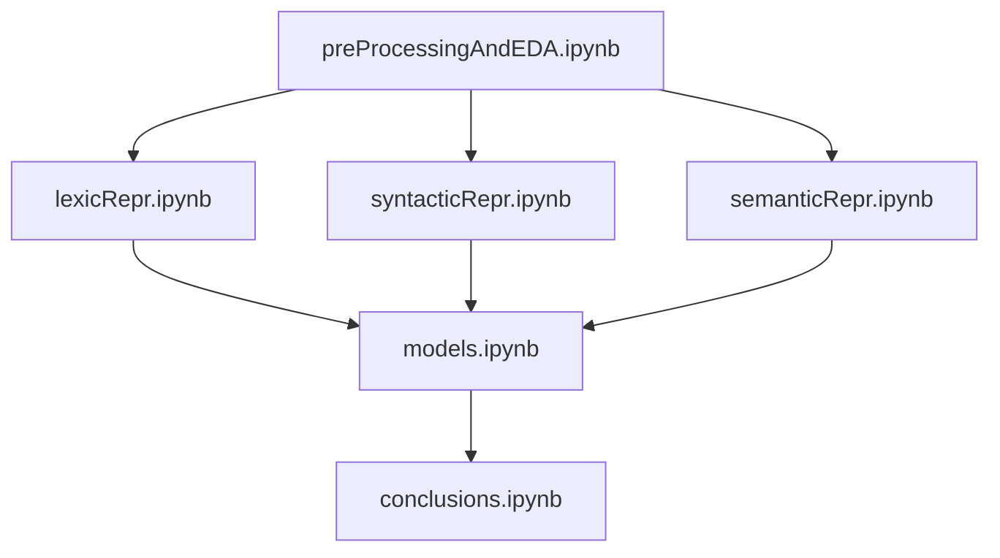

# MI201-groupe-4

## Dataset 

Pour tester avant d'avoir le vrai : 

* https://www.kaggle.com/competitions/tweet-sentiment-extraction/data

# Analyse des Sentiments avec Différentes Représentations

## Objectif du Projet
Ce projet vise à analyser les sentiments exprimés dans des tweets en utilisant trois types de représentations qui capturent différents aspects du texte :

### Représentations Utilisées
1. **Aspect Lexical : TF-IDF**
   - Représentation vectorielle basée sur la fréquence des mots (TF-IDF).
   - Chaque tweet est représenté par un vecteur \( N x 1 \), où \( N \) est le nombre de mots uniques.

2. **Aspect Syntaxique : Word2Vec**
   - Utilisation de Word2Vec pour capturer les relations contextuelles entre les mots.
   - Les tweets sont représentés par des vecteurs \( N x K \), où \( K \) est la dimension des embeddings, et \( N \) le nombre de mots.

3. **Aspect Sémantique : BERT/GPT**
   - Extraction des embeddings à l'aide de modèles pré-entraînés comme BERT ou GPT.
   - Chaque tweet est représenté par un vecteur \( N x K \), avec \( K \) correspondant à la dimension des embeddings.

---

## Structure du Projet
Le projet est organisé autour de différents notebooks pour assurer une modularité et une clarté maximales.

### Description des Notebooks
1. **EDA & Prétraitement (preProcessingAndEDA.ipynb)**
   - Nettoyage des tweets : suppression des emojis, stop words, mise en minuscule, etc.
   - Analyse exploratoire des données, y compris les métadonnées (âge, etc.).

2. **Représentation Lexicale (lexicRepr.ipynb)**
   - Génération des vecteurs TF-IDF.
   - Option pour inclure des bigrammes/trigrammes ou appliquer des filtres de fréquence.

3. **Représentation Syntaxique (syntacticRepr.ipynb)**
   - Construction des embeddings Word2Vec avec ajustements des paramètres (taille de fenêtre, etc.).

4. **Représentation Sémantique (semanticRepr.ipynb)**
   - Génération des embeddings avec BERT/GPT à l'aide de la bibliothèque Hugging Face.

5. **Entraînement des Modèles (models.ipynb)**
   - Entraînement de modèles comme Random Forest, Adaboost et SVM.
   - Validation croisée (K-Fold) pour évaluer la performance des modèles.

6. **Conclusions et Analyse (conclusions.ipynb)**
   - Comparaison des embeddings via des techniques comme t-SNE et DBSCAN.
   - Analyse statistique des résultats : matrice de confusion, précision, rappel, F1-score, ROC AUC, etc.

---

## Résultats Attendus
- Comparaison des performances entre les représentations lexicales, syntaxiques et sémantiques.
- Identification du meilleur modèle pour chaque situation en termes de précision et d'interprétabilité.

---

## Bibliothèques Utilisées
- **Hugging Face Transformers** : Génération des embeddings (BERT/GPT).
- **scikit-learn** : TF-IDF, entraînement des modèles et évaluation des performances.
- **gensim** : Construction des embeddings Word2Vec.
- **matplotlib/seaborn** : Visualisation des données et des résultats.

